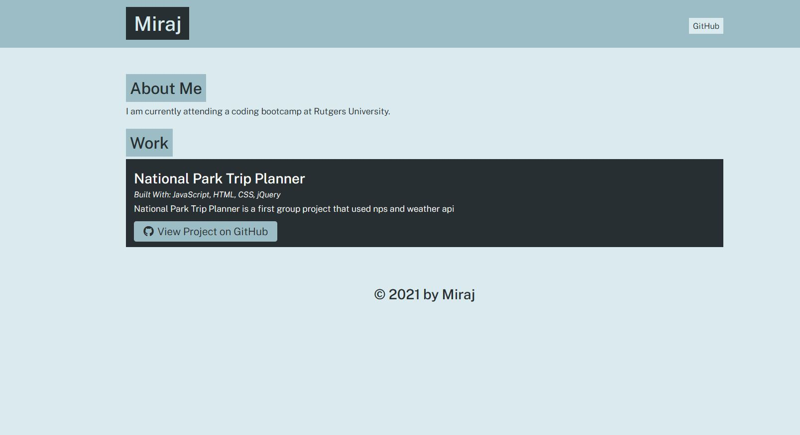

### portfolio-generator

## Purpose

Portfolio-Generator is an node.js based application. The user is asked series of questions on command prompt upon running ' node app ' code. Once all questions are answered, it will create index.HTML and style.CSS in ' dist ' folder. It uses inquirer packages. This application :  

* Uses node.js and npm
* Capstures user input
* Prints dynamic output
* generates HTML File 
* Validates answers
* Conditionally creates About Section
* Uses Promises to write and copy files
 

## Website

https://github.com/miraj00/portfolio-generator

## Screenshots

